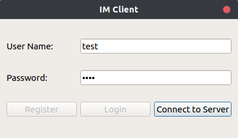
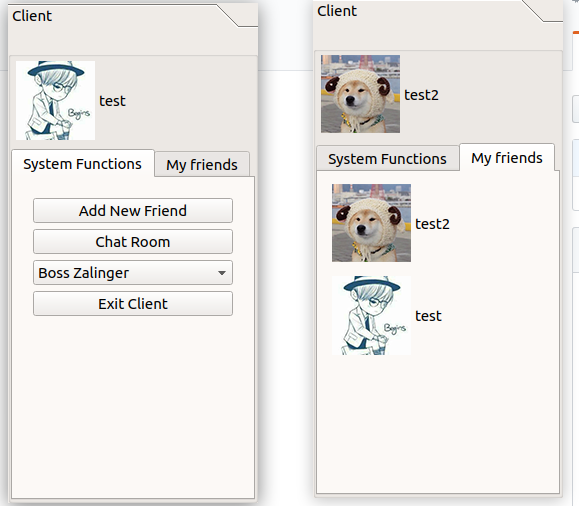
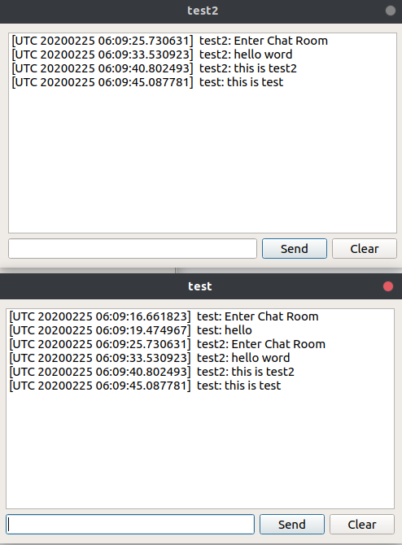

# Instant Messaging Application using Qt and C++
* A socket programming project implemented in Qt and C++ supporting real-time communication.
* Developed server and client using Qt in C++ for real-time communication based on TCP protocol.
* Supported multiple users login at the same time and implemented group chat function for multiple users.
* Used MySQL in the back-end to store the users’ properties and historical messages.
* Implemented features for user registration, password reset and change avatar.

## Client 
> * Used Qt Widget for the interfaces.
> * Used TCP protocol for the communication.

## Server
> * Used MySQL as the back-end server to store historical messages. 
> * Used muduo network library https://github.com/chenshuo/muduo

## Useage
This project requried server to start on the back end which could start use:
> * bash start.sh
Then the server will run in the backend. User could login to the server and perform functionabilities. 

